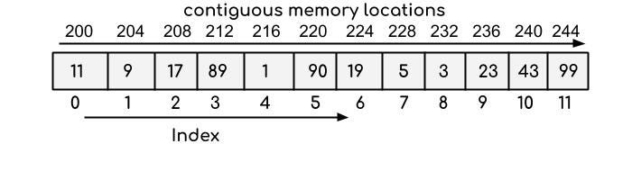
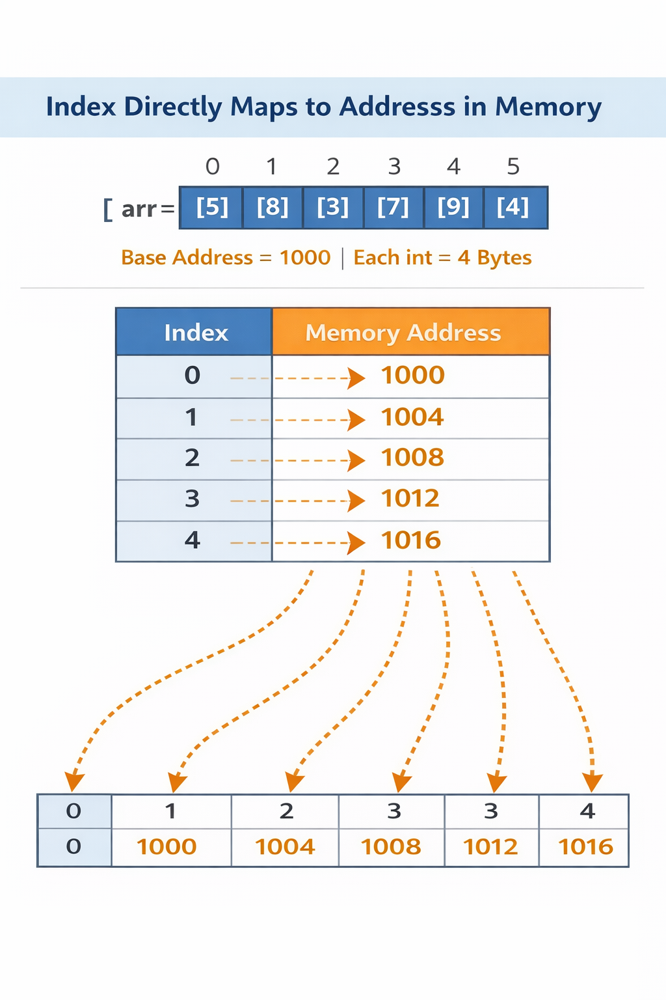

# Arrays:
collection of variable of the same data type and fixed size "base-on index"

start by index=0 end by index= (arr.length-1)

 يعني هي عباره عن مجموعه متغيرات او قيم متخزنين جمب بعض من نفس نوع بيانات يعني ياه string او integer او.....

 وليها حجم ثابت متقدرش تزوده ولا تنقصه ساعه runtime

# Advantage
-Easy to use and create

-Direct access to element via index
# Limitations
1- Fixed size: can not grow or shrink dynamically

2-Homogeneus: All elements must be of the same type

3-Overhead in insertion,deletion,merging

## هنكلم علي اهم مميزه وهي access by index

لي هي سهله ب access by index عشان متخزنه في ذاكره بشكل contiguous memory يعني عناصرها جمب بعض في ذاكره دون فواصل




```
index:     0      1     2       3
value:   [10]   [20]   [30]   [40]
address:   100   104    108    112
```
نوضح بقي لي الوصول ب index سهل لو انت عارف base address بتاع اول عنصر اللي هو 100 مثلا عندنا وعارف ان كل عناصر جمب بعض ومثلا كل int حجمه 4byte يعني عنصر اللي جمبه هيبقي عنوانه 104 ____> index=1 ----> ال address=base address+index * 4=104
نوصل لي *general equation* ال address=base_address+index*element_size 




## note
arr[2] like as arr[50000] ----->O(1)

## دي هي اهم مميزه بتقدمه ال array لان عندك حاجه زي LinkedList هتعرف عشان توصل لعنصر هتضطر تعدي عليهم واحد واحد

# ندخل علي المشاكل بقي في insertion && delete

# insertion

لو عايز تضيف 40 في اخر خانه بس لازم تاكد ان في مكان
```
[10][20][30][]
```
هتضيف عادي
```
[10][20][30][40]
```
ونوع ده سهل عشان حجم زياده و في اخر ----> O(1)

```
Index:  0   1   2   3   4   5
Value: [5] [8] [3] [7] [2] [  ]
```
insert 9 in index =2 
                   
```
[5][8][9][3][7][2]
```
### steps
1-اتاكد ان size يسمح يعني في مكان زياده في اخر

2-تعمل shifting ناحيه يمين لعناصر من اول index اللي عايز تعمل فيه insert لي اخر عناصر

arr[5]=arr[4]
```
[5][8][3][7][2][2]
```
arr[4]=arr[3]
```
[5][8][3][7][7][2]
```
arr[3]=arr[2]
```
[5][8][3][3][7][2]
```
arr[2]=9
```
[5][8][9][3][7][2]
```
تلاحظ ان تلات عناصر اتحركوا عشان تضيف عنصر لذلك عمليه اضافه في array مش افضل حاجه خالص O(n)


## ندخل علي delete:
```
[10][20][30][40]
```
delete 20 from index=1

## steps:

arr[1]=arr[2]
```
[10][30][30][40]
```
arr[2]=arr[3]
```
[10][30][40][40]
```
size--
```
[10][30][40]
```

تلاحظ انك اضطريت تعمل shifting لعناصر زي insertion يعني O(n) وكمان نقصت حجم array


# ندخل علي مشكله تالته وهي ان size ثابت محتاجين نعرف لو اضطرينا نزود size نتصرف ازاي 

اولا اللي هنعمله اسمه resize 

اول خطوه نعمل array جديد size بتاعها ضعف القديم طب لي الضعف عشان لو زودت واحد بس يمكن اضطر اعمل زياده تاني فبحاول اقلل عده تكرار عمليه resize

تاني خطوه ناخد عناصر من array قديمه نحطها في جديده

تالت خطوه نضيف العنصر الجديد و لو عايز اضيفه في مكان معين لسا عارفين فوق هنعمل اي 

```
size=5
[10][20][30][40][50]
```
insert 60
```
size*2
size=10
[][][][][][][][][][]
```
copy old element
```
[10][20][30][40][50][][][][][]
```
insert 60 now
```
[10][20][30][40][50][60][][][][]
```

نقدر منعملش طريقه دي ونستخدم arraylist بتعمل reaize dynamically واسمها بيتغير من لغه برمجه لي تانيه لكن مبدا واحد

java-->arraylist

python-->list

c++-->vector

javascript-->array

شوف انت لغه برمجه اللي بتستخدمها و دور عليها طب ميزه فيها انها بتكبر حجم لوحدها و في اضافه و حذف من اخر بتبقي O(1)
لكن احيانا بتبقي O(n) عشان بتعمل بحجم مبداي غالبا 100 ساعه م تزود في حاله دي بس بتعمل resize وتضاعف حجمها وترجع بعد كده O(1)

# طب امتي اخد قرار اني استخدم array or arraylist عن اي data structure تانيه؟

1-ال array

. لو حجم بيانات معروف
. تريد access مباشره و سريع
. حذف و اضافه قليل او مش موجود
2- ال arraylist
. حجم بيانات مش معروف 
. تريد access مباشر و سريع 
. حذف و اضافه بيكون في اخر

### تقدر تشوف اكواد عملي في ملف Array.java


